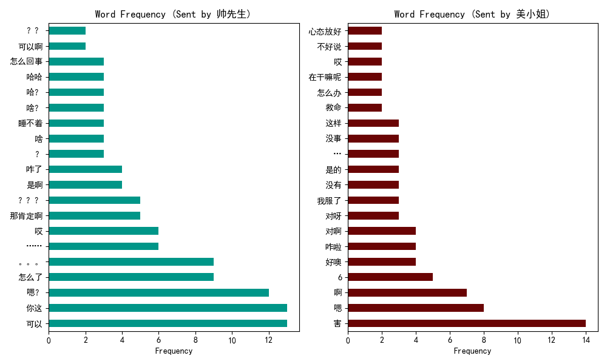
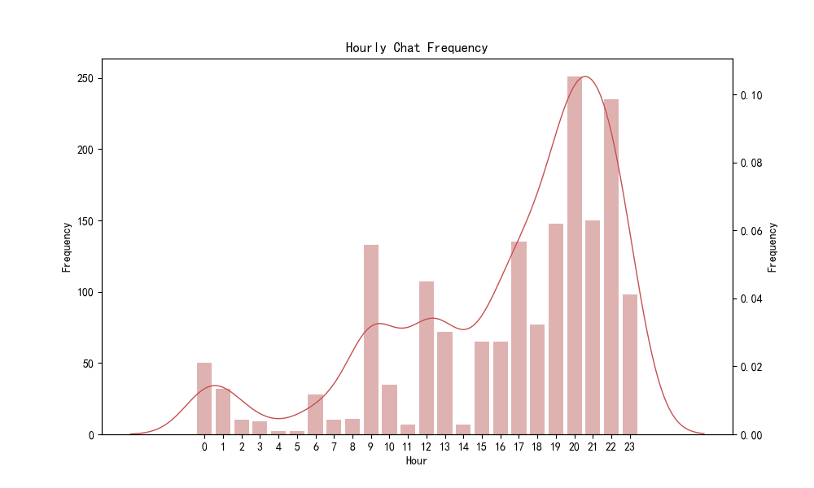
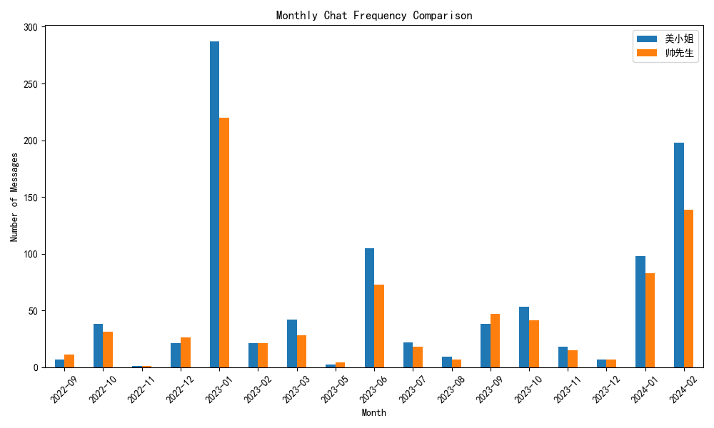

# WeAnalysis: WeChat Conversation Analyzer

## 🌟 Introduction

WeAnalysis is a powerful tool designed to help users delve deep into their conversations on WeChat. By leveraging WeAnalysis, users can gain multidimensional insights into chat frequencies, word frequency analysis, sentiment analysis, and more, understanding conversation patterns and emotional trends better. Our goal is to provide users with a simple yet powerful way to explore and analyze their chat history in a visual format.

## ✨ Features

- **Chat Frequency Analysis**: Analyze the frequency of chats by day and hour to help users identify active chatting periods.
- **Word Frequency Statistics**: Show the most frequently used words, from both the sender's and receiver's perspectives.
- **Sentiment Analysis**: Use NLP technology to analyze the emotional tendencies of chat contents, distinguishing between positive, neutral, and negative emotions.
- **Interaction Pattern Analysis**: Analyze conversation initiation, reply times, and chat block patterns, revealing users' interaction habits.
- **Report Generation**: Provide one-click generation of HTML reports for easy viewing and sharing of analysis results.

## 🚀 Quick Start

1. **Clone the repository**

   ```bash
   git clone https://github.com/yourusername/WeAnalysis.git
   ```

2. **Install Dependencies**

   Ensure Python and related libraries (pandas, matplotlib, seaborn, numpy, snownlp) are installed in your environment.

   ```bash
   pip install -r requirements.txt
   ```

3. **Get the Source Data from WeChat**

    Please refer to [WeChatMsg](https://github.com/LC044/WeChatMsg).
    
    Download your messages from your phone into your computer: [Guideline](https://blog.lc044.love/post/5).

3. **Run Analysis**

   Use the provided sample data or your own WeChat chat export file for analysis.

   ```python
    from ChatAnalysis import ChatAnalysis
    import os
    if __name__ == '__main__':
        output_dir = 'charts'
        if not os.path.exists(output_dir):
            os.makedirs(output_dir)
        chat_analysis = ChatAnalysis('demo_utf8.csv', output_dir, sender_name='帅先生', receiver_name='美小姐')
        chat_analysis.preprocess_data()  # 数据预处理
        chat_analysis.plot_chat_frequency_by_day()  # 绘制每天聊天频率的柱状图并保存
        chat_analysis.plot_word_frequency(top_n=20)  # 绘制词频分析图并保存
        chat_analysis.plot_chat_frequency_by_hour()
        chat_analysis.plot_chat_comparison()
        chat_analysis.plot_monthly_chat_frequency_comparison()
        chat_analysis.plot_weekly_chat_heatmap()
        chat_analysis.sentiment_analysis()
        chat_analysis.analyze_interaction_patterns()
        chat_analysis.generate_html_report(output_dir, "chat_analysis_template.html")
   ```

Then, open the file chat_analysis_report.html.

You can see what you are like to say, like this:


You can also see the chat frequency by hour, like this:


If you want to see the chat frequency by month, you can find the figure like this:


More things waiting you to find!

## 🤝 Contributing

We welcome any form of contribution, whether it's feature suggestions, code contributions, or documentation improvements. Please see [Contributing Guide](CONTRIBUTING.md) for how to get started.

## 📄 License

This project is licensed under the [MIT License](LICENSE). Please make sure you read and accept the license terms before using it.

## 💖 Acknowledgments

Special thanks to all the developers and contributors who have contributed to this project. We look forward to seeing everyone in the community get involved, building a more complex and multifunctional tool together.